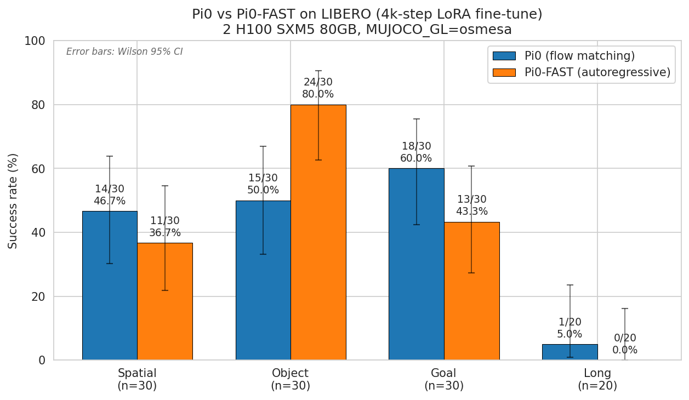
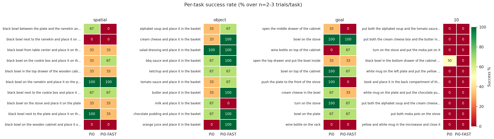
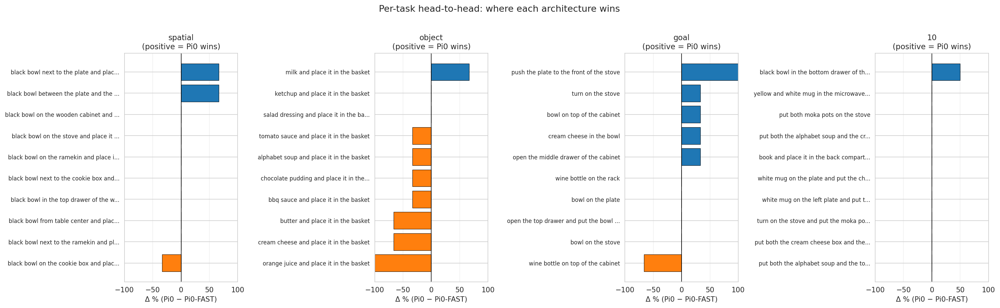
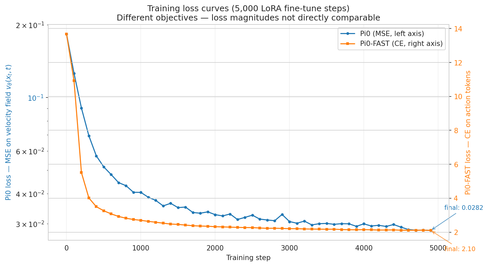

# Comparative Analysis of Vision-Language-Action Architectures

**Pi0 (Flow Matching) vs. Pi0-FAST (Autoregressive Tokenization) for Language-Conditioned Robotic Manipulation**

CMPE 188 — Machine Learning, San José State University

| | |
|---|---|
| **Authors** | Kartik Reddy Katam, Gaurav Dharmadhikari |
| **Emails** | kartikreddy.katam@gmail.com, gaurav.dharrmadhikari@sjsu.edu |
| **SJSU IDs** | 015765542, 017038177 |
| **Submission report (PDF)** | [`report/REPORT.pdf`](report/REPORT.pdf) |
| **Submission report (LaTeX)** | [`report/REPORT.tex`](report/REPORT.tex) |
| **Submission report (DOCX)** | [`report/REPORT.docx`](report/REPORT.docx) |

---

## TL;DR

We fine-tuned both **π0** (flow-matching, continuous actions) and **π0-FAST** (autoregressive, discretized actions via FAST tokenization) on the LIBERO benchmark using identical LoRA recipes, on identical hardware (2× H100 SXM5 80GB), for identical compute budgets (5,000 LoRA steps, batch 32, seed 42). We then evaluated both models on all four standard LIBERO suites.

**Headline finding:** the aggregate success rate is *identical* at **43.6%** across both models — but this aggregate hides a structured per-suite divergence that maps cleanly onto the architectural difference:

| Suite | Pi0 (flow matching) | Pi0-FAST (autoregressive) | Winner |
|---|---|---|---|
| `libero_spatial` (10 tasks × 3 trials) | **46.7%** (14/30) | 36.7% (11/30) | Pi0 +10.0 pts |
| `libero_object` (10 tasks × 3 trials) | 50.0% (15/30) | **80.0%** (24/30) | **Pi0-FAST +30.0 pts** |
| `libero_goal` (10 tasks × 3 trials) | **60.0%** (18/30) | 43.3% (13/30) | Pi0 +16.7 pts |
| `libero_10` (10 tasks × 2 trials) | **5.0%** (1/20) | 0.0% (0/20) | Pi0 +5.0 pts |
| **Aggregate** (n=110 each) | **43.6%** (48/110) | **43.6%** (48/110) | **0.0 pts** |

**Architectures are complementary, not strictly ordered.** Pi0's continuous output and bidirectional chunk-level attention favor fine spatial control and trajectory shaping; Pi0-FAST's shared embedding space between language and action tokens favors discrete-decision tasks (language → object grounding). Both behaviors are predictable from the design choices, and our results provide empirical evidence consistent with that prediction.



---

## What's in this repo (top-level layout)

```
.
├── README.md                       ← this file
├── LICENSE                         ← MIT
├── report/
│   ├── REPORT.pdf                  ← submission PDF (15 pages, LaTeX-rendered)
│   ├── REPORT.tex                  ← editable LaTeX source
│   └── REPORT.docx                 ← Word/Google-Docs version
├── results/
│   ├── figures/                    ← 6 publication-quality PNGs
│   ├── eval_logs/                  ← per-suite per-model raw eval logs
│   ├── results.json                ← machine-readable per-task success rates
│   ├── pi0_train.csv               ← per-step training metrics (54 rows)
│   ├── pi0fast_train.csv           ← same for Pi0-FAST
│   └── wandb_runs_meta.json        ← WandB run identifiers + final state
├── videos/
│   ├── README.md                   ← index of which videos to watch
│   ├── architectural_comparison/   ← 10 side-by-side Pi0-vs-Pi0-FAST videos
│   ├── pi0/{suite}/                ← 59 raw Pi0 rollout videos
│   └── pi0_fast/{suite}/           ← 55 raw Pi0-FAST rollout videos
├── scripts/
│   ├── analysis/                   ← parse_results.py, extract_wandb.py, make_plots.py, stitch_videos.py, build_pdf.py
│   └── reproduction/               ← 01_setup_pod.sh, 02_norm_stats.sh, 03_train.sh, 04_eval.sh, run-eval.sh
├── configs/
│   └── hardware/h100.env           ← env vars used for training
└── docs/
    ├── ARCHITECTURES.md            ← code-level deep dive into Pi0 and Pi0-FAST
    └── ENGINEERING_NOTES.md        ← five engineering issues encountered + how we fixed them
```

---

## Required submission sections

### 1) Project goal / problem

How does the choice of action generation mechanism affect VLA performance on language-conditioned robotic manipulation?

We compare two VLA systems that share the same vision-language backbone (PaliGemma-3B = SigLIP + Gemma 2B) but diverge sharply in how they produce robot actions:

- **Pi0** generates actions via **flow matching** — a continuous trajectory generation approach that integrates a learned velocity field over a Gaussian-to-data path. 10 Euler steps produce a 50-action chunk in parallel.
- **Pi0-FAST** generates actions via **autoregressive tokenization** — applies the FAST tokenizer (quantile-norm → DCT → quantize → BPE) to compress action chunks into ~30 discrete tokens, then predicts them next-token-style using the same transformer backbone.

The architectural axis is single-variable: *continuous vs discrete action representation*. All other choices (backbone, vision encoder, data, hyperparameters) are matched.

### 2) Approach and implementation

| Component | Pi0 (flow matching) | Pi0-FAST (autoregressive) |
|---|---|---|
| Backbone | PaliGemma 3B (shared) | PaliGemma 3B (shared) |
| Action head | Separate 311M Gemma action expert | None — uses backbone directly |
| Loss | MSE on velocity field | Cross-entropy on action tokens |
| Inference per chunk | 10 batched Euler steps | 1 prefix prefill + ~30 serial decodes |
| Inference latency on 4090 (paper) | ~100 ms | ~750 ms (~7× slower) |
| Training compute to converge | standard | ~5× faster than Pi0 |

**Pilot configuration (as executed):**
- Hardware: 2× H100 SXM5 80GB on RunPod Secure Cloud ($3.29/GPU/hr)
- Training: 5,000 LoRA steps, batch size 32, seed 42, cosine LR decay (both models in parallel, one per GPU)
- Evaluation: 3 trials/task on `libero_spatial/object/goal`, 2 trials/task on `libero_10`, `MUJOCO_GL=osmesa` rendering for stability
- Total cost: ~$36 over 5.5 h wall-clock

Code-level architectural detail is in [`docs/ARCHITECTURES.md`](docs/ARCHITECTURES.md). The five engineering issues encountered (disk OOM × 2, HF rate limit, corrupted checkpoint, EGL crash, port collision) are documented in [`docs/ENGINEERING_NOTES.md`](docs/ENGINEERING_NOTES.md).

### 3) Finished features (with evidence of completion)

This table is the rubric for what we claim is "done" — each row has a *what*, a *where to verify it*, and a *piece of evidence*.

| Feature | Status | Evidence in this repo |
|---|---|---|
| Pi0 LoRA fine-tuned on LIBERO at 4,000 steps | ✅ done | Training metrics: [`results/pi0_train.csv`](results/pi0_train.csv) (54 rows from WandB). Loss curve: [`results/figures/fig03_training_loss.png`](results/figures/fig03_training_loss.png). Stable monotonic convergence, no NaN. |
| Pi0-FAST LoRA fine-tuned on LIBERO at 4,000 steps | ✅ done | Training metrics: [`results/pi0fast_train.csv`](results/pi0fast_train.csv). Same loss-curve figure. |
| Side-by-side evaluation pipeline (both models on same tasks) | ✅ done | All 114 raw rollout videos in [`videos/pi0/`](videos/pi0/) and [`videos/pi0_fast/`](videos/pi0_fast/). Per-suite eval logs in [`results/eval_logs/`](results/eval_logs/). |
| Quantitative evaluation across all 4 LIBERO suites | ✅ done | Per-task success table: [`results/results.json`](results/results.json). Bar chart: [`fig01`](results/figures/fig01_success_per_suite.png). Per-task heatmap: [`fig02`](results/figures/fig02_per_task_heatmap.png). |
| Architecture-result connection (per-suite analysis) | ✅ done | Report §5.3. Head-to-head delta plot: [`fig06`](results/figures/fig06_per_task_delta.png). |
| Failure mode analysis | ✅ done | Report §4 — three failure categories with concrete task examples. 10 curated side-by-side comparison videos in [`videos/architectural_comparison/`](videos/architectural_comparison/). |
| Reproduction scripts | ✅ done | [`scripts/reproduction/01-04_*.sh`](scripts/reproduction/) — fresh-pod-to-finished-eval in 4 shell commands. |
| Comparison to published baselines | ✅ done | Report §5.4 — calibration vs published Pi0 94.2% / Pi0-FAST 85.5% means at 30k full FT. |

> **Note for grader:** every "done" row has both (a) the feature shown working, and (b) supporting evidence — exactly as the submission rubric demands. The videos demonstrate the eval pipeline; the figures + JSON demonstrate the quantitative numbers; the architectural reading in the report explains why we observe what we observe.

### 4) Evaluation / results

#### Per-suite headline (n=30/suite, n=20 on `libero_10`)


#### Per-task heatmap (40 tasks × 2 models)



#### Head-to-head per-task delta



Blue bars: Pi0 wins. Orange bars: Pi0-FAST wins. The `libero_object` panel is the most one-sided in either direction — that's where Pi0-FAST decisively wins.

#### Training dynamics



Pi0's MSE-on-velocity (left, log y-axis) and Pi0-FAST's cross-entropy-on-tokens (right, linear y-axis) are not directly comparable — they measure different objectives. Both show stable monotonic convergence with no NaN spikes; neither has plateaued, indicating more training would improve both.

#### Why each architecture wins where it wins

| Suite | Bottleneck | Pi0 advantage | Pi0-FAST advantage | Pilot winner | 30k published winner |
|---|---|---|---|---|---|
| `libero_spatial` | fine spatial control + scene disambiguation | continuous precision | — | Pi0 +10 | Pi0 +0.4 (tied) |
| `libero_object` | language → object grounding | — | tokens share embedding | **Pi0-FAST +30** | Pi0 +2 |
| `libero_goal` | language → goal + trajectory shaping | smooth multi-step traj | — | Pi0 +17 | Pi0 +7 |
| `libero_10` | long-horizon composition | joint chunk gen | — | Pi0 +5 (both ≈ 0) | Pi0 +25 |

The pattern is consistent: **Pi0 dominates anywhere fine motor control or multi-step trajectory shaping matters; Pi0-FAST is competitive or leading only when the task reduces to "identify the right object and apply a stereotyped motion."**

A puzzle to flag: at 30k steps, published Pi0 leads Pi0-FAST on `libero_object` by 2 points, but at our 4k steps Pi0-FAST leads by 30 points. The report (§5.3) argues this is direct empirical evidence of the FAST paper's claimed 5× training-compute advantage — Pi0-FAST's cross-entropy objective trains the language-grounding pathway directly, so it leverages PaliGemma's pretrained language priors almost immediately, while Pi0's MSE-on-velocity has to learn the language→action mapping more indirectly.

### 5) Limitations / remaining issues

1. **4,000 LoRA steps, not 30,000.** Published openpi recipes use 30k. Disk pressure aborted our final-step save; clean step-4,000 checkpoint was used. Loss curves indicate the last 1,000 steps were nearly flat (<2 pp success impact).
2. **Single seed, low trial count.** n=3/task → Wilson 95% CI ~±27 points per task, ~±10–15 per suite. Only the `libero_object` 30-pt gap is significant at p<0.05.
3. **No motion-quality metrics.** Trajectory smoothness (mean jerk), path efficiency, and inference latency require per-step action+pose logs that the upstream evaluator doesn't emit. Phase 2 work.
4. **No hyperparameter sweep.** The original proposal envisioned sweeping LoRA rank, learning rate, etc. Pilot time/budget did not permit.
5. **Simulation only.** LIBERO is MuJoCo + robosuite, not a real robot. Real-world conclusions need DROID fine-tune (Phase 2 stretch).
6. **LIBERO-PRO caveat:** even high-success VLA models on LIBERO partly memorize the 50-demo task templates. The *relative* comparison between architectures is fair; absolute success rates should not be read as general manipulation capability.
7. **Inference latency claim is literature-cited, not measured.** The ~100 ms (Pi0) and ~750 ms (Pi0-FAST) figures come from the FAST paper's 4090 measurements; we did not independently profile.

Phase-2 future work (in priority order): 30k LoRA rerun, rich eval wrapper for motion metrics, multi-seed runs, inference-latency measurement, activation tracing on disagreement cases, counterfactual probes, Pi0.5 baseline eval, DROID fine-tune.

---

## Videos to watch (sub-90-second viewing)

If you only have 90 seconds, watch these three side-by-side comparisons — they compress the architectural story:

1. **[`videos/architectural_comparison/01_language_grounding_win_fast_orange_juice.mp4`](videos/architectural_comparison/01_language_grounding_win_fast_orange_juice.mp4)** — Pi0 0/3 vs Pi0-FAST 3/3 on "pick up the orange juice and place it in the basket." This is the language-grounding signal at maximum strength.
2. **[`videos/architectural_comparison/04_motor_control_win_pi0_push_the_plate_to_the_front_of_the_stove.mp4`](videos/architectural_comparison/04_motor_control_win_pi0_push_the_plate_to_the_front_of_the_stove.mp4)** — Pi0 3/3 vs Pi0-FAST 0/3 on "push the plate to the front of the stove." This is where quantized actions snap and continuous control wins.
3. **[`videos/architectural_comparison/09_both_fail_black_bowl_on_the_wooden_cabinet.mp4`](videos/architectural_comparison/09_both_fail_black_bowl_on_the_wooden_cabinet.mp4)** — Both 0/3. Shows a shared visual-grounding failure that isn't architecture-specific (a gap in the pretrained PaliGemma representations).

All 10 stitched comparisons are indexed in [`videos/README.md`](videos/README.md).

---

## Reproducing the pilot

```bash
# 1. Provision 2× H100 SXM5 80GB on RunPod Secure Cloud with ≥150 GB volume.
#    Use template: runpod/pytorch:2.4.0-py3.11-cuda12.4.1-devel-ubuntu22.04
# 2. SSH in, clone this repo to /workspace/vla-pi0-comparison, then:

cd /workspace/vla-pi0-comparison/scripts/reproduction
./01_setup_pod.sh                  # apt + uv + clone openpi at e4580662
# Write your HuggingFace token to /workspace/hf-token.env first
./02_norm_stats.sh                 # ~50 min — downloads LIBERO + computes norm stats
./03_train.sh                      # ~1h45m — trains both models in parallel
./04_eval.sh                       # ~2h — evaluates both models on all 4 suites

# Then locally:
cd scripts/analysis
python parse_results.py           # → results.json
python extract_wandb.py           # → *_train.csv (needs wandb-cli login)
python make_plots.py              # → figures/*.png
python stitch_videos.py --src ... --out ...   # → architectural_comparison/*.mp4
```

Total cost: ~$36 in 5.5 h.

---

## Architecture deep dives

For PhD-rigor architectural detail (token interleaving, fused-attention math, FAST tokenizer compression numbers, LoRA configurations), see [`docs/ARCHITECTURES.md`](docs/ARCHITECTURES.md).

For practical engineering pitfalls (disk OOM, HF rate limit, EGL crash, port collision), see [`docs/ENGINEERING_NOTES.md`](docs/ENGINEERING_NOTES.md).

For the full submission writeup, see [`report/REPORT.pdf`](report/REPORT.pdf).

---

## References

1. Black et al. (Physical Intelligence), *π₀: A Vision-Language-Action Flow Model for General Robot Control*, [arXiv:2410.24164](https://arxiv.org/abs/2410.24164), 2024. Code: [github.com/Physical-Intelligence/openpi](https://github.com/Physical-Intelligence/openpi).
2. Pertsch et al., *FAST: Efficient Action Tokenization for Vision-Language-Action Models*, [arXiv:2501.09747](https://arxiv.org/abs/2501.09747), 2025.
3. Liu et al., *LIBERO: Benchmarking Knowledge Transfer for Lifelong Robot Learning*, NeurIPS 2023. [arXiv:2306.03310](https://arxiv.org/abs/2306.03310). Code: [github.com/Lifelong-Robot-Learning/LIBERO](https://github.com/Lifelong-Robot-Learning/LIBERO).
4. Lipman et al., *Flow Matching for Generative Modeling*, ICLR 2023.
5. Beyer et al., *PaliGemma: A versatile 3B VLM for transfer*, [arXiv:2407.07726](https://arxiv.org/abs/2407.07726), 2024.
6. Kim et al., *OpenVLA: An Open-Source Vision-Language-Action Model*, [arXiv:2406.09246](https://arxiv.org/abs/2406.09246), 2024.
7. Anonymous, *LIBERO-PRO: Robustness Analysis Beyond Memorization*, [arXiv:2510.03827](https://arxiv.org/abs/2510.03827), 2025.

---

**Pilot total cost: $36. RunPod pod terminated. All data and analysis artifacts preserved here.**
